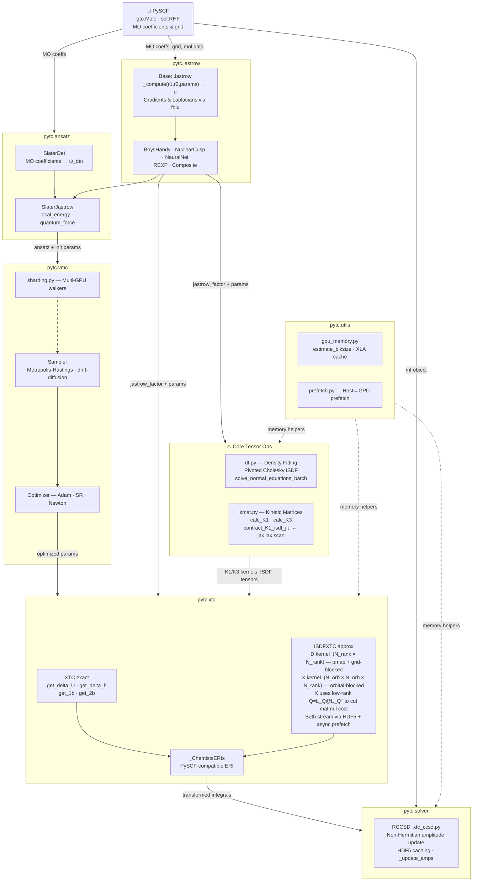

# pytc Architecture

`pytc` (Python TransCorrelation package) is a library for performing transcorrelated calculations in quantum chemistry using JAX for automatic differentiation and GPU acceleration.

## Module Hierarchy & Data Flow Diagram

> **Key**: solid arrows = primary data flow · dashed arrows = utility/support · ⚠️ = memory-critical paths requiring `jax.lax.scan` / chunked `vmap`

## High-Level Data Flow

The typical workflow in `pytc` involves setting up a molecule and its mean-field state with PySCF, and then using `pytc` to construct and optimize a transcorrelated ansatz or generate transcorrelated integrals.

1.  **PySCF Integration**: A calculation begins with a PySCF `gto.Mole` object and a solved mean-field object (e.g., `scf.RHF(mol)`).
2.  **Ansatz Construction**: The PySCF data initializes an ansatz object (e.g., `pytc.ansatz.sj.SlaterJastrow`). This involves combining a reference Slater determinant (`pytc.ansatz.det`) with one or more Jastrow factors (`pytc.jastrow`).
3.  **Optimization/Integrals**:
    *   **VMC Optimization**: The Jastrow factor parameters are optimized using Variational Monte Carlo (`pytc.vmc`), which uses JAX to sample electron configurations and compute local energies and gradients via Metropolis-Hastings.
    *   **Transcorrelated Integrals**: Alternatively, the optimized Jastrow factor is used to construct transcorrelated effective Hamiltonians or integrals (`pytc.xtc`). This can be dense tensor contractions or accelerated using Interpolative Separable Density Fitting (ISDF).
4.  **Post-HF Solvers**: The resulting transformed integrals are fed back into standard PySCF solvers or custom `pytc` solvers (e.g., `pytc.solver.xtc_ccsd.RCCSD`) to obtain correlation energies.

---

## Detailed Module Breakdown

### `pytc.jastrow` (Jastrow Factors)
This module defines the parameterized functions that capture explicit electron correlation.
*   **Base Class**: `pytc.jastrow.base.Jastrow` (implemented as a Flax `@struct.dataclass`).
*   **Core Methods**: 
    *   `init_params(self)`: Returns initial JAX arrays.
    *   `_compute(self, r1, r2, params)`: The core computation mapping electron coordinates to the scalar log-Jastrow exponent $u$.
    *   `get_log_grads_r1`, `laplacian_r`: Utilizes **`folx`** (forward-mode autodiff) to compute gradients and Laplacians of the Jastrow factor with respect to electron coordinates. This is heavily relyed upon for kinetic energy evaluation.
*   **Implementations**: `BoysHandy` (`bh.py`), `NuclearCusp` (`ncusp.py`), Neural Networks (`nn.py`), `REXP` (`rexp.py`), and `CompositeJastrow` (`composite.py`).

### `pytc.ansatz` (Wavefunction Ansatz)
Combines reference wavefunctions with Jastrow factors.
*   **`SlaterJastrow` (`sj.py`)**: The primary class. It holds a list of `SlaterDet` objects and a `Jastrow` factor.
    *   `local_energy(self, walker, params)`: Computes $H \Psi / \Psi$.
    *   `quantum_force(self, walker, params)`: Computes gradients for importance sampling.
*   **`SlaterDet` (`det.py`)**: Handles the evaluation of the Slater determinant (and its derivatives) using molecular orbital coefficients from PySCF.

### `pytc.vmc` (Variational Monte Carlo)
Implements the MCMC sampling and optimization.
*   **Samplers (`metropolis.py`, `moves.py`)**: Implements standard Metropolis-Hastings and drift-diffusion importance sampling.
*   **Optimizers (`optimization.py`, `optimizer.py`)**: Routines to update Jastrow parameters, minimizing energy variance or expectation values. Includes standard gradient descent (Adam via `optax`) and second-order methods like Stochastic Reconfiguration (SR) / Newton methods.
*   **Sharding (`sharding.py`)**: Utilities leveraging `jax.experimental.mesh_utils` and `jax.sharding` to distribute Walkers across multiple GPUs automatically.

### `pytc.xtc` (Transcorrelated Integrals)
**Note: `pytc.xtc` is a single file module (`xtc.py`), not a directory.**
This module constructs transcorrelated integrals, handling demanding tensor contractions.
*   **`XTC`**: The standard exact integration path.
    *   Methods like `get_delta_U`, `get_delta_h`, and `get_1b`/`get_2b` calculate the 1-body and 2-body correction tensors added to the standard Coulomb Hamiltonian.
*   **`ISDFXTC`**: The Interpolative Separable Density Fitting approximation path. Instead of $O(N^4)$ arrays, it factorizes the integrals using ISDF rank, trading precision for scalability.
*   Both classes provide a `make_eris` method to produce a `_ChemistsERIs` object that PySCF-like solvers can ingest.

### Core Tensor Operations (`pytc/df.py` & `pytc/kmat.py`)
These files handle the heavy-lifting math for transcorrelated integrals and ISDF.
*   **`df.py` (Density Fitting)**: Implements the ISDF decompositions. It includes memory-efficient pivoted Cholesky algorithms (`_pivoted_cholesky_phi`, `_pivoted_cholesky_grad`) and LU-decomposition solvers for structured least-squares (`solve_normal_equations_batch`). These routines are critical for scaling up to large basis sets without OOMs.
*   **`kmat.py` (Kinetic Matrices)**: Implements generation and tensor contractions for the $K_1$ and $K_3$ matrices arising from the transcorrelated kinetic energy.
    *   Contains exact evaluation methods (`calc_K1`, `calc_K3`).
    *   Contains highly optimized, batched JAX `scan` loops for ISDF-accelerated contractions (e.g., `contract_K1_isdf_jit`, `contract_K1_minus_K2_isdf_jit`), which process components sequentially to minimize peak VRAM usage.

### `pytc.solver` (Post-Hartree-Fock Solvers)
Contains solvers tailored for the non-Hermitian nature of the transcorrelated Hamiltonian.
*   **`RCCSD` (`solver/xtc_ccsd.py`)**: A Restricted CCSD implementation adapted from PySCF. It accepts the `_ChemistsERIs` from the `xtc` module. It features specific memory management and HDF5 caching (`_update_amps`) to prevent out-of-memory errors on GPUs when contracting amplitudes with the modified integrals.

### `pytc.utils` (Utilities)
Supporting functions.
*   **`gpu_memory.py`**: Helpers to estimate block sizes and limit JAX/XLA memory allocations dynamically during large tensor contractions.
*   **`prefetch.py`**: Multithreading utilities to prefetch data from host memory (HDF5) to GPU memory during solver iterations.

---

## Best Practices for AI Agents

1.  **Understand Shapes**: When working with `pytc.xtc` or `pytc.jastrow`, always trace the tensor shapes via docstrings. The equations involve multi-dimensional arrays (e.g., $N_{elec} \times N_{elec} \times 3$ for inter-electron vectors).
2.  **Immutability and Pure Functions**: The VMC loop and XTC integral generations are heavily `jax.jit` compiled. Ensure your proposed code maintains functional purity. Do not mutate arrays in place; use `.at[idx].set(val)`.
3.  **`numpy` vs `jax.numpy`**: 
    *   Use exact `numpy` for PySCF interfacing and HDF5 I/O.
    *   Use `jax.numpy` for everything inside the models (`jastrow`, `ansatz`, `vmc` steps, `xtc` tensor contractions).
4.  **Autodiff Laplacians**: If altering kinetic energy or Jastrow forms, heavily rely on the `folx` library for forward-mode Laplacians rather than deriving analytical forms unless performance dictates otherwise.
