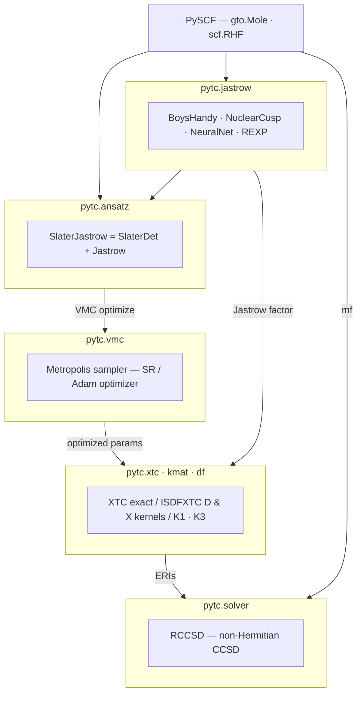

# PyTC


**Py**thon **T**rans**C**orrelation package

## Features

- **Modular Jastrow factors**: Boys-Handy, Nuclear Cusp, Neural Network (EE/EN/EEN), REXP, Polynomial, and Composite
- **JAX-based automatic differentiation** for Jastrow gradients and Laplacians via [folx](https://github.com/microsoft/folx)
- **VMC-based Jastrow optimization** with second-order Newton and first-order machine learning optimizers, e.g. Adam
- **Deterministic Jastrow optimization** via second-quantized optimization algorithm
- **GPU acceleration** via JAX for both VMC sampling and integral calculations using multiple GPUs
- **Transcorrelated integrals**: K1, K2, K3 two-body and xTC approximated three-body integrals
- **Interpolative Separable Density Fitting (ISDF)** for efficient integral calculations—up to 800+ orbitals with controlled accuracy
- **Seamless PySCF integration**: Works directly with PySCF mean-field objects and CCSD solvers

## Dependencies

- Python >= 3.10
- numpy
- scipy
- jax (autodiff and GPU acceleration)
  > **Note**: To run on GPUs, you must install the correct version of JAX. See the [JAX installation guide](https://github.com/google/jax#installation).
  > For example, for CUDA 12:
  > ```bash
  > pip install -U "jax[cuda12]"
  > ```
- flax (neural network)
- folx (latest version from GitHub required for multi-GPU sharding fixes):
  ```bash
  pip install git+https://github.com/microsoft/folx.git
  ```
 
- optax (machine learning optimizers)
- pyscf

## Installation

**Requirements**: Python 3.10 or higher

To install the package in editable mode:
```bash
pip install -e .
```

For GPU support (CUDA 12):
```bash
pip install -e .
pip install -U "jax[cuda12]"
```

## Quick Start

### VMC-based Jastrow Optimization with xTC-CCSD

```python
import jax
jax.config.update("jax_enable_x64", True)
import jax.numpy as jnp
from pyscf import gto, scf

from pytc.vmc import optimize_ref_var
from pytc.ansatz.sj import SlaterJastrow
from pytc.ansatz.det import SlaterDet
from pytc.jastrow import CompositeJastrow, NuclearCusp, BoysHandy

# Set up a molecule with PySCF
mol = gto.Mole()
mol.atom = "Be 0 0 0"
mol.basis = 'cc-pVDZ'
mol.build()

mf = scf.RHF(mol)
mf.kernel()

# Create Slater determinant and Jastrow factors
det = SlaterDet.create(mol, mf.mo_coeff)
jncusp = NuclearCusp.create(mol, name="ncusp")
jbh = BoysHandy.create(mol, name="bh")
jastrow = CompositeJastrow.create([jncusp, jbh])

# Create Slater-Jastrow ansatz
sj_ansatz = SlaterJastrow.create(mol, jastrow, [det])
params = [jastrow.init_params(), jnp.ones(1)]

# Optimize with VMC
opt_results = optimize_ref_var(
    sj_ansatz,
    params=params,
    n_walkers=5000,
    n_steps=50,
    n_opt_steps=10,
    optimizer_type='newton',
)
```

### ISDF-accelerated xTC Integrals

```python
import jax
jax.config.update("jax_enable_x64", True)
import jax.numpy as jnp
from pyscf import gto, scf, cc

from pytc import xtc
from pytc.jastrow import rexp

# Set up molecule
mol = gto.M(atom='O 0 0 0; H 0 1 0; H 0 0 1', basis='ccpvdz')
mf = scf.RHF(mol)
mf.kernel()

# Create Jastrow factor
my_jastrow = rexp.REXP()
jastrow_params = {'alpha': jnp.array([1.0])}

# Exact XTC (for small systems)
my_xtc = xtc.XTC.from_pyscf(mf, my_jastrow, grid_lvl=2)
eris_exact = my_xtc.make_eris(mf, jastrow_params)

# ISDF-accelerated XTC (scales to large systems)
n_rank = 10 * my_xtc.n_orb  # ISDF rank
my_isdf_xtc = xtc.ISDFXTC.from_xtc(my_xtc, n_rank=n_rank)
my_isdf_xtc = my_isdf_xtc.isdf(jastrow_params)
eris_isdf = my_isdf_xtc.make_eris(mf, jastrow_params)

# Run xTC-CCSD with PySCF
mycc = cc.rccsd.RCCSD(mf)
e_corr, t1, t2 = mycc.kernel(eris=eris_isdf)
```

## Code Overview


<div align="center">



</div>

## Usage

See the `pytc/examples/` directory for complete examples:
- `Be_vmc_ref_opt_xtc_ccsd.py` — VMC optimization with xTC-CCSD
- `h2o_jastrow_xtc_isdf_ccsd.py` — ISDF convergence study
- `h2o_jax_isdf_xtc.py` — JAX-based ISDF example

To run the tests:
```bash
python -m unittest discover -v
```

## Publications

*No publications yet. This section will be updated when papers using pytc are published.*

## Contributing

Contributions are welcome! Here's how you can help:

### Reporting Issues
- Use the [GitHub Issues](https://github.com/nickirk/pytc/issues) page to report bugs or request features
- Include a minimal reproducible example when reporting bugs
- Describe the expected vs. actual behavior

### Submitting Pull Requests
1. Fork the repository and create a feature branch
2. Make your changes, following the existing code style
3. **Run the tests** before submitting:
   ```bash
   python -m unittest discover -v
   ```
4. Submit a pull request with a clear description of your changes

### Code Style
- Follow the existing code conventions in the repository
- Use type hints where appropriate
- Add docstrings to new functions and classes

## For AI Agents

If you are an AI coding assistant working on this repository, please read the documentation in the `.agents/` directory before proceeding. This directory contains important rules, architecture details, and step-by-step workflows.

- `.agents/rules.md`: Core conventions and constraints for `pytc`.
- `.agents/ARCHITECTURE.md`: High-level explanation of the codebase structure.
- `.agents/workflows/`: Checklists and standardized processes for adding code (e.g., adding a new Jastrow factor, creating PRs).
