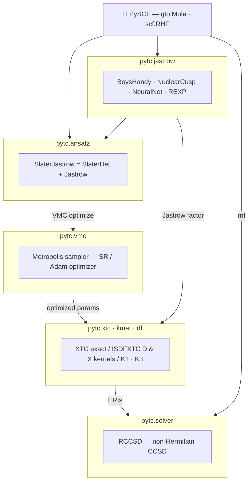

<p align="left">
  
</p>

# PyTC


[](https://nickirk.github.io/pytc-docs/)


**Py**thon **T**rans**C**orrelation package

Documentation: https://nickirk.github.io/pytc-docs/

## Development provenance

PyTC was initiated in Prof. Ali Alavi's group at the Max Planck Institute for Solid State Research, where the early-stage development of the transcorrelated-method infrastructure took place. Its current development is based in Prof. Tianyu Zhu's group at Yale University.

## Features

- **Modular Jastrow factors**: Boys-Handy, Nuclear Cusp, Neural Network (EE/EN/EEN), REXP, Polynomial, and Composite
- **JAX-based automatic differentiation** for Jastrow gradients and Laplacians via [folx](https://github.com/microsoft/folx)
- **VMC-based Jastrow optimization** with second-order Newton and first-order machine learning optimizers, e.g. Adam
- **GPU acceleration** via JAX for both VMC sampling and integral calculations using multiple GPUs
- **Transcorrelated integrals**: K1, K2, K3 two-body and xTC approximated three-body integrals
- **Interpolative Separable Density Fitting (ISDF)** for efficient integral calculations — empirical T ∝ n_orb^1.76 scaling, demonstrated past 1200 orbitals on a single B200 GPU
- **PySCF interoperability with JAX-native CCSD**: Builds on PySCF mean-field objects and molecular data, then runs xTC-CCSD with PyTC's in-house JAX solver

## Dependencies

- Python >= 3.10
- numpy
- scipy
- jax (autodiff and GPU acceleration)
  > **Note**: To run on GPUs, you must install the correct version of JAX. See the [JAX installation guide](https://github.com/google/jax#installation).
  > For example, for CUDA 12:
  > ```bash
  > pip install -U "jax[cuda12]"
  > ```
- flax (neural network)
- folx (≥0.2.22, installed automatically as a dependency)
- optax (machine learning optimizers)
- pyscf

## Installation

**Requirements**: Python >= 3.10

Install from PyPI:

```bash
python -m pip install pytc-qc
```

The PyPI distribution is named `pytc-qc`; the Python import package remains `pytc`.

For GPU support (CUDA 12):

```bash
python -m pip install pytc-qc
python -m pip install -U "jax[cuda12]"
```

For source checkout / development install, see the [installation guide](https://nickirk.github.io/pytc-docs/installation.html).

## Quick Start

```python
import jax
jax.config.update("jax_enable_x64", True)
import jax.numpy as jnp
from pyscf import gto, scf

from pytc import xtc
from pytc.jastrow import rexp
from pytc.solver import jax_xtc_ccsd

# Set up molecule
mol = gto.M(atom='O 0 0 0; H 0 1 0; H 0 0 1', basis='ccpvdz')
mf = scf.RHF(mol)
mf.kernel()

# Create Jastrow factor
my_jastrow = rexp.REXP()
jastrow_params = {'alpha': jnp.array([1.0])}

# Exact XTC (for small systems)
my_xtc = xtc.XTC.from_pyscf(mf, my_jastrow, grid_lvl=2)
eris_exact = my_xtc.make_eris(mf, jastrow_params)

# ISDF-accelerated XTC (scales to large systems)
n_rank = 10 * my_xtc.n_orb  # ISDF rank
my_isdf_xtc = xtc.ISDFXTC.from_xtc(my_xtc, n_rank=n_rank)
my_isdf_xtc = my_isdf_xtc.isdf(jastrow_params)
eris_isdf = my_isdf_xtc.make_eris(mf, jastrow_params)

# Run xTC-CCSD with pytc's own JAX-native solver
mycc = jax_xtc_ccsd.RCCSD(mf, my_isdf_xtc, jastrow_params)
e_corr, t1, t2 = mycc.kernel(eris=eris_isdf)
```

See the [quickstart guide](https://nickirk.github.io/pytc-docs/quickstart.html) for additional examples and explanations.

## Code Overview


<div align="center">



</div>

## Usage

See the `pytc/examples/` directory for a numbered walkthrough of the full
methodology on H₂O (Jastrow VMC optimization → averaging → dense → ISDF → FNO
xTC-CCSD):
- `01_vmc_optimize_jastrow.py` — reference-variance VMC Jastrow optimization
- `02_load_and_average_jastrow_params.py` — Polyak–Ruppert parameter averaging
- `03_dense_xtc_ccsd.py` — dense (non-ISDF) xTC-CCSD
- `04_isdf_xtc_ccsd.py` — ISDF xTC-CCSD (vs. 03's dense reference)
- `05_make_fno_xtc_ccsd.py` — FNO (MP2 natural-orbital) truncation scan

To run the tests:
```bash
python -m unittest discover -v
```

## Publications

*No publications yet. This section will be updated when papers using pytc are published.*

## Contributing

Contributions are welcome! Here's how you can help:

### Reporting Issues
- Use the [GitHub Issues](https://github.com/nickirk/pytc/issues) page to report bugs or request features
- Include a minimal reproducible example when reporting bugs
- Describe the expected vs. actual behavior

### Submitting Pull Requests
1. Fork the repository and create a feature branch
2. Make your changes, following the existing code style
3. **Run the tests** before submitting:
   ```bash
   python -m unittest discover -v
   ```
4. Submit a pull request with a clear description of your changes

### Code Style
- Follow the existing code conventions in the repository
- Use type hints where appropriate
- Add docstrings to new functions and classes

## For AI Agents

If you are an AI coding assistant working on this repository, please read the documentation in the `.agents/` directory before proceeding. This directory contains important rules, architecture details, and step-by-step workflows.

- `.agents/rules.md`: Core conventions and constraints for `pytc`.
- `.agents/ARCHITECTURE.md`: High-level explanation of the codebase structure.
- `.agents/workflows/`: Checklists and standardized processes for adding code (e.g., adding a new Jastrow factor, creating PRs).
